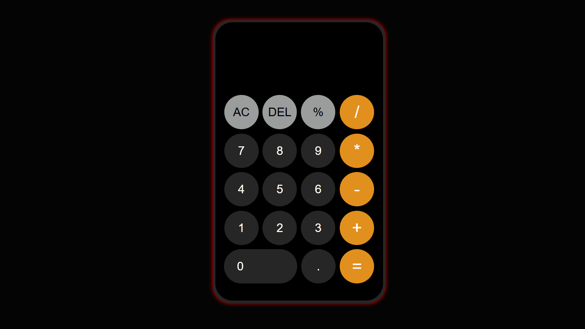

# 🧮 JavaScript Calculator

A modern, responsive calculator built using **HTML**, **CSS**, and **JavaScript**. Inspired by Apple’s calculator design — clean UI, dynamic font resizing, and error handling.

---

## ✨ Features

- Responsive and sleek UI
- Basic arithmetic operations: `+`, `-`, `*`, `/`, `%`
- Functional buttons: `AC`, `DEL`, `=`
- Auto font resize based on input length
- Input length capped at 18 digits
- Handles `NaN`, `Infinity`, and invalid inputs
